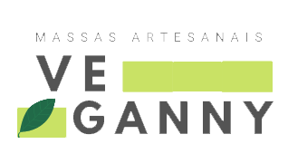

<h3 align="center"> 
  

🍃Restaurante Vegano | Massas artesanais 🍃

</h3>

##

<!-- 
> [Sobre a API](#sobre); 
> [Como é aplicada](#aplicacao-da-api); 
> [Rotas](#rotas); 
> [Demandas de negócio](#demandas-de-negocio); 
> [Tecnologias e dependências para o uso da API](#tecnologias-dependencias); 
> [Implementações futuras](#implementações-futuras) -->

#### **Sobre a API**
Com esta API é possível oferecer ao cliente da Rede de Restaurantes 'Veganny', facilidade e praticidade
na hora de escolher o menu.  Ela foi idealizada com a necessidade de se ter um delivery independente, livre de taxas
extras. Também pode ser muito eficaz em lojas físicas, pois devido a atual situação pandêmica, é necessário manter o distanciamento entre pessoas.
Sendo assim, os pedidos também podem ser feitos diretamente no restaurante, evitando o contato direto com os atendentes.

##

#### **Como é aplicada**

- [X] Lista todas as unidades disponíveis do Restaurante 
- [X] Lista o cardápio específico de cada unidade
- [X] Insere o pedido específico no carrinho
- [X] Atualiza o preço e quantidade do produto especificado 
- [X] Remove o pedido do carrinho

##

#### **Rotas**
Esta API está sendo executada na `porta 3333` e para que todas as rotas possam ser acessadas localmente é necessário usar `http://localhost:3333/` antes dos endpoints de requisição.

|VERBO | ENDPOINT | DESCRIÇÃO|
|------|------|----------|
|GET | /veganny | Retorna uma lista com todos as unidades do restaurante Veganny|
|GET | /menu| Retorna todos os cardápios disponíveis|
|GET | /menu/recife| Retorna o cardápio da unidade 'Recife'|
|GET | /menu/olinda| Retorna o cardápio da unidade 'Olinda'|
|GET | /menu/paulista | Retorna o cardápio da unidade 'Paulista'|
|GET | /cart/:id | Retorna o item escolhido no carrinho |
|POST | /veganny | Cria uma nova unidade do restaurante Veganny|
|POST | /menu | Cria um novo pedido para o carápio correspondente ao ID requerido|
|PATCH | /cart/:id | Edita a quantidade e valor do pedido correspondente ao ID requerido.|
|DELETE | /cart/:id | Exclui pedido correspondente ao ID requerido.|

##

#### **Demandas de negócio**

- [X] Não poderá ser criado uma unidade com o mesmo nome 
- [X] Não poderá ser criado um pedido com a mesma descrição

##

#### **Tecnologias e dependências para o uso da API**

|Ferramenta | Descrição |
|-----------|-----------|
|JavaScript | Linguagem de programação. |
Node JS | Ambiente de execução do JavaScript. |
|Express | Framework Node JS. |
|Mongoose | Dependência que interage com o MongoDB para a conexão da database, criação do model e das collections. |
|Nodemon | Dependência que observa as atualizações realizadas nos documentos para rodar o    servidor automaticamente. |
|Cors | Dependência que facilita a permissão de acesso à API. |
|Dotenv | Dependência que ajuda a proteger dados sensíveis.           
|npm |  Gerenciador de pacotes. |
|MongoDB |  Banco de dados não relacional orientado a documentos. |
|Robo 3T | Interface gráfica para verificar se os dados foram persistidos na database. |
|Postman | Interface gráfica para realizar os testes. |
|Git/GitHub | Versionamento de código. |
|Heroku | Plataforma em nuvem para fazer o deploy. |  

##

#### **Implementações futuras**

- [ ] Integração ao front-end 
- [ ] Autenticação 
- [ ] Integração a API de CEP
- [ ] Integração a API de pagamento

##

_O restaurante Veganny, é uma empresa fictícia para a elaboração do projeto de conclusão de curso da {reprograma}_

##

Conecte-se comigo! 

  
  
  

##

Feito com ❤, por Dannyeli Cristina
